# 🫀 Heart Disease Risk Predictor

## Project Overview

The **Heart Disease Risk Predictor** is a data-driven project designed to predict the likelihood of heart disease in patients based on clinical and demographic features. This tool is intended to support **public health workers, clinicians, and healthcare stakeholders** in identifying high-risk individuals early, enabling preventative interventions and informed decision-making.

**Objectives:**

- Build a robust predictive model for heart disease risk.
- Provide clear, interpretable insights into key risk factors.
- Develop a reusable workflow for preprocessing, modeling, and evaluation.
- Prepare for eventual deployment in an interactive dashboard for real-time predictions.

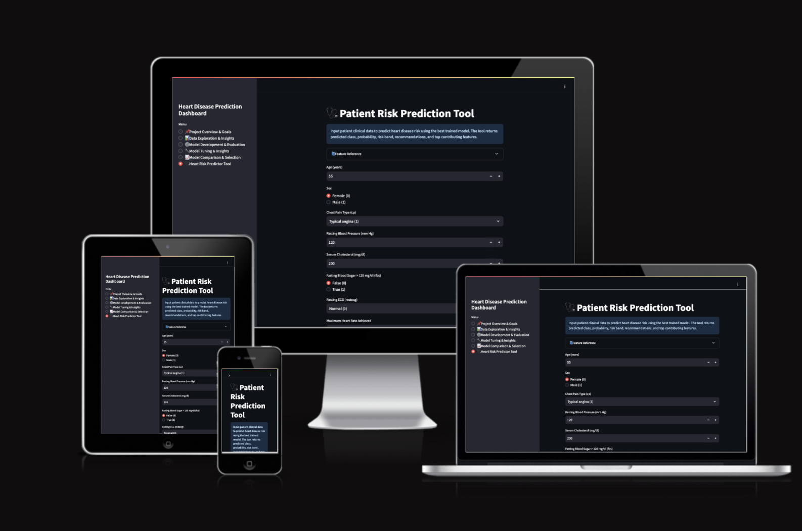

The live site can be found here: [Heart Disease Risk Predictor](https://project-5-heart-risk-predictor-427e46733288.herokuapp.com/)

---

## Business Context & Case

Heart disease remains one of the leading causes of morbidity and mortality worldwide. Early detection of high-risk patients can significantly reduce complications and healthcare costs.  

**Business Goals:**

1. Identify patients at high risk of heart disease.
2. Understand which factors contribute most to risk.
3. Provide actionable insights for preventive healthcare interventions.
4. Deliver reproducible, interpretable machine learning pipelines.

**Success Criteria:**

- Achieve **≥80% accuracy** on classification tasks.
- Maintain **high recall** to minimize false negatives.
- Maintain clean, documented, and reusable code pipelines.

**ML Tasks Mapped to Business Case:**

- **Classification:** Predict whether a patient is at risk (`HeartDisease` 0/1).

---

## Hypotheses & Validation

Before starting the analysis, we formulated the following hypotheses:

1. **Age and cholesterol levels are positively correlated with heart disease risk.**  
   - *Validation:* Statistical tests and correlation heatmaps confirmed that higher `age` and `chol` values were more common among patients with heart disease.

2. **Resting blood pressure (`trestbps`) and maximum heart rate achieved (`thalach`) are associated with heart disease risk.**  
   - *Validation:* EDA showed that patients with higher `trestbps` and lower `thalach` were more likely to have heart disease. Both variables appeared as important predictors in model feature importance rankings.

3. **Machine learning models can achieve at least 80% accuracy in predicting heart disease risk.**  
   - *Validation:* Our best-performing pipeline (Random Forest) achieved test ROC-AUC > 0.80, confirming this hypothesis.

---

## Rationale Mapping

Each business requirement was mapped to a specific analysis and ML task:

- **Business Requirement 1:** Identify key factors that correlate with heart disease.  
  - *Data Task:* Exploratory analysis (heatmaps, distributions, group comparisons).  
  - *ML Task:* Feature importance ranking from Random Forest, XGBoost, LightGBM and Logistic Regression models

- **Business Requirement 2:** Predict likelihood of heart disease for a given patient.  
  - *Data Task:* Data preprocessing (scaling, encoding, cleaning).  
  - *ML Task:* Train, evaluate, and deploy classification models (Logistic Regression, Random Forest, XGBoost, LightGBM).  
  - *Dashboard Feature:* “Patient Risk Prediction Tool” page.

---

## ML Business Case

The client is interested in moving beyond descriptive analysis to **predictive analytics**:

- **Problem:** Healthcare professionals and patients often lack quick, data-driven tools for estimating heart disease risk.  
- **Proposed Solution:** Develop and deploy a machine learning model that predicts individual risk based on medical and lifestyle factors.  
- **Value:**  
  - Supports earlier interventions and preventive care.
  - Helps clinicians prioritize high-risk patients.  
- **Feasibility:**  
  - Dataset includes a balanced set of medical and lifestyle features.  
  - Models achieved ROC-AUC > 0.80, confirming predictive capability.  
  - Deployment via Streamlit enables direct user interaction.

---

## Kanban Board – User Stories & Epics

The project workflow is organized using a **Kanban methodology** to track progress and prioritize tasks.

M → Must have (core to meeting business requirements)

S → Should have (improves project quality)

C → Could have (nice-to-have, “if time allows”)

### Epic 1 – Information Gathering & Data Collection

| Priority | User Story |
|----------|------------|
| [M] | As a data scientist, I want to download and store the UCI Heart Disease dataset from Kaggle so that I can work with a clean, local copy for analysis. |
| [M] | As a project team member, I want to document all feature definitions and their units so that stakeholders and developers understand the meaning of each input variable. |
| [S] | As a data scientist, I want to explore dataset structure (rows, columns, data types) so that I can plan preprocessing steps effectively. |

### Epic 2 – Data Visualization, Cleaning & Preparation

| Priority | User Story |
|----------|------------|
| [M] | As a data scientist, I want to visualise distributions of all features so that I can detect anomalies, missing values, and outliers. |
| [M] | As a data scientist, I want to perform correlation analysis and feature importance scoring so that I can identify the most relevant variables for predicting heart disease. |
| [M] | As a data scientist, I want to handle missing/invalid values and outliers so that my dataset is ready for model training without bias. |
| [S] | As a data scientist, I want to create a cleaned, preprocessed dataset file so that I can reuse it across different model experiments. |

### Epic 3 – Model Training, Optimization & Validation

| Priority | User Story |
|----------|------------|
| [M] | As a machine learning engineer, I want to train baseline models (Logistic Regression, Random Forest) so that I can compare performance and select a strong candidate. |
| [M] | As a machine learning engineer, I want to perform hyperparameter tuning with cross-validation so that I can improve model accuracy and reduce overfitting. |
| [M] | As a machine learning engineer, I want to track model performance metrics (accuracy, ROC-AUC, recall, precision) so that I can ensure the model meets the 80% accuracy target and low false negatives. |
| [C] | As a machine learning engineer, I want to use SHAP or LIME for explainability so that stakeholders understand how the model makes predictions. (Should have, but becomes Could have if time is tight) |

### Epic 4 – Dashboard Planning, Designing & Development

| Priority | User Story |
|----------|------------|
| [M] | As a frontend developer, I want to design a user-friendly Streamlit interface so that public health workers can easily navigate the dashboard. |
| [M] | As a public health worker, I want to input patient data into a form so that I can receive a real-time prediction of heart disease risk. |
| [S] | As a public health worker, I want to see the most important features influencing a prediction so that I can better understand the patient’s risk factors. |
| [S] | As a stakeholder, I want to view a project summary and dataset overview in the dashboard so that I can quickly grasp the purpose and scope of the tool. |

### Epic 5 – Dashboard Deployment & Release

| Priority | User Story |
|----------|------------|
| [M] | As a DevOps engineer, I want to deploy the Streamlit app online so that stakeholders can access the tool without installing anything. |
| [S] | As a project manager, I want to implement version control for the model and dashboard code so that I can manage updates and rollbacks safely. |
| [C] | As a stakeholder, I want to have a technical page on the dashboard showing metrics and pipeline details so that I can verify the robustness of the solution. |

## Dataset Content

The **Heart Disease dataset** is sourced from the **UCI Machine Learning Repository** via Kaggle. The dataset contains clinical and demographic data for patients, which will be used to predict the presence of heart disease.  

Each row represents a patient, and each column represents a clinical or demographic attribute.

### Feature Definitions

| Variable | Meaning | Units / Categories |
|----------|---------|------------------|
| `age` | Patient age | Years |
| `sex` | Patient gender | 1 = Male, 0 = Female |
| `cp` | Chest pain type | 0: Typical Angina, 1: Atypical Angina, 2: Non-anginal pain, 3: Asymptomatic |
| `trestbps` | Resting blood pressure | mm Hg |
| `chol` | Serum cholesterol | mg/dl |
| `fbs` | Fasting blood sugar | 1 = >120 mg/dl, 0 = ≤120 mg/dl |
| `restecg` | Resting electrocardiographic results | 0: Normal, 1: ST-T wave abnormality, 2: Left ventricular hypertrophy |
| `thalach` | Maximum heart rate achieved | bpm |
| `exang` | Exercise-induced angina | 1 = Yes, 0 = No |
| `oldpeak` | ST depression induced by exercise relative to rest | Depression level (numeric) |
| `slope` | Slope of peak exercise ST segment | 0: Upsloping, 1: Flat, 2: Downsloping |
| `ca` | Number of major vessels colored by fluoroscopy | 0–3 |
| `thal` | Thalassemia | 3 = Normal, 6 = Fixed defect, 7 = Reversible defect |
| `target` | Heart disease diagnosis | 1 = Presence, 0 = Absence |

---

### Project Terms & Jargon

- **Patient:** Individual under clinical evaluation.  
- **Feature / Variable:** An attribute measured for each patient.  
- **Risk Factor:** A feature correlated with the presence of heart disease.  
- **Prospect Patient:** A new patient whose heart disease risk is unknown.  

---

## Project Design Heart Disease Prediction Dashboard

This project delivers an **interactive, AI-powered dashboard** for heart disease risk prediction. It focuses on **data visualization, model evaluation, and patient risk prediction**, emphasizing usability, interpretability, and actionable insights.

### 🛠 Core Functionality

- **Executive Overview:** Provides context for the problem, key dataset statistics, and risk factor summaries. Highlights actionable insights for healthcare decision-making.
- **Exploratory Data Analysis (EDA):** Interactive plots for feature distributions, correlations, and feature interactions to understand key risk factors.
- **Model Development & Evaluation:**
  - Compare baseline and tuned models using ROC-AUC, F1, confusion matrices, and feature importance plots.
  - Evaluate model performance on validation and holdout test sets.
- **Prediction Tool:**
  - **Simple Mode:** Core clinical features for quick patient risk predictions.
  - **Advanced Mode:** Full 22-feature input for more precise predictions and risk stratification.
  - Outputs include predicted class, probability, risk band, and recommendations.

### 🌈 Color Scheme & Typography

- Minimal and accessible palette prioritizing clarity and readability.
- Streamlit default typography enhanced with **info boxes, success messages, and warnings** for visual hierarchy.
- Consistent styling for headings, subheadings, and body text across pages.

### 🖼 Layout & Responsiveness

- **Page-based organization** ensures a clear workflow:
  1. **Overview & Goals:** Executive summary, dataset insights, key risk factors.
  2. **EDA & Insights:** Distributions, correlation heatmaps, interactive scatterplots.
  3. **Model Evaluation:** Baseline vs. tuned models, metrics tables, ROC curves, confusion matrices.
  4. **Advanced Experiments:** Model comparison across pipelines and selection of best-performing model.
  5. **Prediction Tool:** Single-patient or advanced multi-feature input with real-time predictions.
- Fully responsive layout within Streamlit — interactive visualizations adapt to screen size and user selections.

### 🧭 User Interaction & Guidance

- **Collapsible sections** and **expanders** for optional advanced inputs.
- **Interactive visualizations** using Matplotlib, Seaborn, and Plotly for detailed exploration.
- **Contextual guidance** via info boxes, warnings, and success messages explains outputs and next steps.
- Predictions include actionable insights with risk bands and recommendations for clinical interpretation.
  
---

## Workbook Workflow - Heart Disease Risk Predictor

### Notebook 1 — Data Upload & Initial Inspection

**Purpose:**  
Introduce and load the heart disease dataset for exploration and preprocessing.

**Key Features:**

- Upload dataset from local files or Kaggle.
- Inspect structure, rows, columns, and data types.
- Identify missing values and invalid entries.
- Initial observations guide preprocessing strategy.

**Outcome:**  
Dataset loaded, cleaned of major inconsistencies, and ready for deeper preprocessing.

### Notebook 2 — Data Preprocessing & Feature Engineering

**Purpose:**  
Understand feature distributions, relationships, and importance before modeling.

**Key Features:**

- Visualize distributions and correlations.
- Identify predictive features.
- Examine multicollinearity to reduce redundancy.
- Rank features by relevance for candidate models.

**Outcome:**  
Informed selection of features for model training, ensuring interpretability and predictive power.

### Notebook 3 — Exploratory Data Analysis (EDA) & Feature Selection

**Purpose:**  
Transform raw data into a machine-learning-ready format.

**Key Features:**

- Handle missing values.
- Encode categorical variables (one-hot or binary encoding).
- Scale numeric features to standardize magnitude.
- Engineer new features (e.g., age groups, cholesterol ratios, interaction terms).
- Detect and treat outliers to reduce bias.

**Outcome:**
Cleaned, numeric, fully-preprocessed dataset saved for model training.  

### Notebook 4 — Model Training & Baseline Performance

**Purpose:**  
Train multiple ML models and establish baseline performance.

**Key Features:**

- Models used: Logistic Regression, Random Forest, XGBoost, LightGBM.
- Split data into training and validation sets.
- Evaluate baseline metrics: accuracy, precision, recall, F1, ROC-AUC.
- Identify strengths and weaknesses of each model for further tuning.

**Outcome:**  
Baseline performance recorded; models selected for hyperparameter optimization.

### Notebook 5 — Hyperparameter Tuning & Advanced Experiments

**Purpose:**  
Optimize model performance using systematic tuning and cross-validation.

**Key Features:**

- GridSearchCV or randomized search for hyperparameter optimization.
- Cross-validation to ensure robust performance estimates.
- Compare tuned models across metrics and select top performers.

**Outcome:**  
Tuned models ready for final evaluation, with improved generalization over baseline.

### Notebook 6 — Final Evaluation & Deployment Prep

**Purpose:**  
Assess generalization of tuned models and prepare the best pipeline for deployment.

**Key Features:**

- Evaluate models on holdout test set using classification metrics and ROC-AUC.
- Visualize confusion matrices and ROC curves.
- Analyze feature importance for tree-based models.
- Compare models to select the best-performing pipeline.
- Save evaluation results and deployment-ready pipeline.

**Outcome:**  
Best model identified and saved; evaluation results documented for reproducibility and reporting.

### Notebook 7 — Model Deployment & Inference

**Purpose:**  
Enable deployment and reproducible inference on new patient data.

**Key Features:**

- Load deployment-ready pipeline from Notebook 6.
- Provide helper functions for input alignment and inference.
- Enhanced predictions with probabilities, risk bands (Low/Medium/High), recommendations, and top feature contributions.
- Test predictions on simplified clinical inputs and full feature sets.
- Backup deployment pipeline for production use.

**Outcome:**  
Pipeline ready for API/web integration; interpretable and actionable predictions validated.

---

## Prediction Model Details

### Classification Model — Heart Disease Risk

We aim to develop a machine learning model to predict the likelihood of heart disease in patients based on clinical and demographic features. The target variable is **categorical** and contains **2 classes**:

- `0` = No heart disease  
- `1` = Presence of heart disease  

This is a **supervised, 2-class, single-label classification model**.

**Goal:**  
Provide healthcare practitioners and public health stakeholders with reliable insights to identify high-risk patients early and inform preventive interventions.

### Model Success Metrics

- **Recall ≥ 80%** for detecting patients with heart disease (`1`) on both train and test sets.  
- Precision for predicting no heart disease (`0`) should also be **≥ 80%** to avoid overestimating risk.  

**Failure Criteria:**

- If F1 for heart disease (1) < 0.8, the model risks misidentifying high-risk patients.
- If Accuracy for non-heart disease (0) < 0.8, the model may produce too many false alarms or unnecessary concern.

### Model Output

- A **binary flag**: `0` (no heart disease) or `1` (heart disease).  
- **Probability score** for each patient indicating the risk of heart disease.  

**Input Data Collection:**

- Online: patient completes a clinical form with features such as age, sex, blood pressure, cholesterol, chest pain type, maximum heart rate, etc.  
- Offline: clinician or public health worker collects input during patient interview and enters data into the tool.  

**Inference:** Predictions are generated **on the fly**, not in batch mode.

### Training Data

- Source: UCI Heart Disease dataset via Kaggle (~1,000 patient records).  
- Features: Clinical and demographic variables, excluding identifiers.  
- Preprocessing includes handling missing values, categorical encoding, feature scaling, and engineered features such as cholesterol ratios and age groups.

### Pipeline Details

1. **Baseline Models:** Logistic Regression, Random Forest, XGBoost, LightGBM.  
2. **Tuning:** Hyperparameter optimization using GridSearchCV and cross-validation.  
3. **Evaluation Metrics:** Accuracy, Precision, Recall, F1-score, ROC-AUC.
4. **Multi-class Risk Band Classification:** Patients can be categorized into `Low`, `Medium`, or `High` risk based on predicted probability thresholds.
5. **Deployment:** Saved pipeline enables real-time inference in web or API-based applications.

---

## Dashboard - Heart Disease Prediction Tool

### Overview

This Streamlit dashboard predicts heart disease risk using clinical patient data. It includes EDA, model training, ablation studies, advanced experiments, and an inference tool for real-time predictions.

## Dashboard Design (Streamlit App Pages)

### Dashboard pages

1. **📌 Project Overview & Goals**

     - Quick project summary, dataset description, and business requirements.
     - Understand the purpose of the project and key predictive modeling goals.
  
2. **📊 Data Exploration & Insights**
     - Exploratory Data Analysis (EDA) including distributions, correlations, and multivariate relationships.
     - Guides feature selection and model preparation.

3. **⚙️ Model Development & Evaluation**
     - Train multiple machine learning models (Logistic Regression, Random Forest, XGBoost, LightGBM).
     - Compare performance metrics: Accuracy, F1-score, ROC-AUC.

4. **🔧 Model Tuning & Insights**
     - Evaluate feature contributions via ablation studies.
     - Display confusion matrices, ROC curves, and feature importance.

5. **📈 Model Comparison & Selection**
     - Compare tuned models on holdout test set.
     - Select the best-performing model for deployment.

6. **🩺 Heart Risk Predictor Tool**
     - Real-time patient risk prediction using core and advanced clinical features.
     - Outputs risk probability, predicted class, risk band, clinical recommendations, and feature contributions.

### Multiple pages

### Page 1: Quick Project Summary

**Before the analysis:**

I intended this page to provide a high-level summary of the project to new users and stakeholders.  

**After the analysis:**  

The page provides:

- Quick project summary
- Project terms & jargon
- Dataset description
- Business requirements:
  - Predict heart disease risk
  - Identify high-risk patients
  - Provide actionable clinical recommendations

**Outcome:**

Users understand the purpose of the project, the data being used, and the key goals for predictive modeling.

### Project overview

### Project overview with sample data

### Page 2: Exploratory Data Analysis (EDA)

**Before the analysis:**

I aimed to answer: “Which clinical variables are associated with heart disease?” 

**After the analysis:**

The page provides:

- Checkbox: Inspect dataset (rows, columns, first 10 records)
- Display correlations between features and heart disease
- Individual plots showing distribution of key features (e.g., age, cholesterol, max heart rate)
- Parallel plots to examine multivariate relationships

**Outcome:**

Insights guide feature selection and inform the ML models.

### EDA features

### EDA features distribution

### EDA correlation heatmap

### EDA interactive feature

### Page 3: Model Development and Evaluation

**Before the analysis:**

I planned to train several machine learning models and compare performance metrics.  

**After the analysis:**

The page provides:

- ML pipeline steps for each model (Logistic Regression, Random Forest, XGBoost, LightGBM)
- Performance metrics: Accuracy, F1, ROC-AUC
- Observations and considerations after training

**Outcome:**

Identifies the best-performing models for further evaluation.

### Model Development

### Model Development Interactive Options

### Page 4: Model Tuning and Insights

**Before the analysis:**

I wanted to assess the contribution of each feature and verify the impact of engineered features.  

**After the analysis:**

The page provides:

- Tuned model performance comparison
- Confusion matrix and ROC curve for selected models
- Tree-based feature importance (Random Forest, XGBoost, LightGBM)
- Dynamic notes explaining model-specific observations

**Outcome:**

Users see which features are most influential and validate feature engineering.

### Tuned Models

### Tuned Models Interactive Options

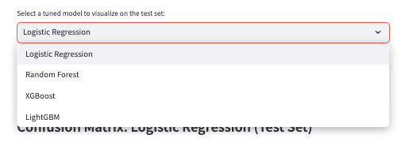

### Page 5: Model Comparison and Selection

**Before the analysis:**

Goal: Compare tuned models on a holdout test set to select the best-performing pipeline.  

**After the analysis:**

The page provides:

- Comparative performance metrics on the holdout test set
- Highlight of the best model based on recall and overall performance
- Barplots visualizing metrics across models
- Actionable insights for deployment

**Outcome:**

Provides confidence in the final model pipeline for real-world deployment.

### Best Model Selection

### Page 6: Inference Tool (Core Patient Prediction)

**Before the analysis:**

I wanted a page that allows quick, actionable predictions for typical users while also providing an option to explore advanced inputs for extreme or high-risk cases.

**After the analysis:**

The page provides:

- **Simple Input Section** for core clinical features:
  - Age, sex, chest pain type, blood pressure, cholesterol, max heart rate, ST depression, exercise-induced angina, slope, major vessels, thalassemia
  - “Run Prediction” button
  - Outputs: predicted class, probability, risk band and clinical recommendation
- **Optional Advanced Input Section** (expandable):
  - All 22 features including engineered variables (`chol_age_ratio`, `oldpeak_thalach_ratio`, etc.)
  - Dataset placeholders for source tracking
  - “Run Full Advanced Prediction” button
  - Same outputs as simple mode

**Outcome:**  

- Quick and intuitive predictions for standard cases improve user experience.  
- Advanced input allows in-depth exploration, testing extreme or rare patient scenarios, and validating the model’s predictions.  
- Provides a flexible interface catering to both casual users and clinical/data specialists.

### Heart Risk Predictor Tool (Simple)

### Heart Risk Predictor Tool examples (Simple)

### Heart Risk Predictor Tool Example Results (Simple)

### Heart Risk Predictor Tool (Advanced)

---

## Data Flow/Model Overview

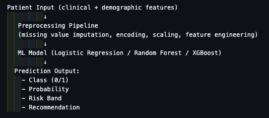

---

## Potential Additional Features

Some ideas to make the project more complete or impressive:

- Data / ML features:

  - Trend tracking: Store patient predictions over time (if using a database).

  - Feature interaction visualizations: Show correlations, e.g., age × cholesterol effect on risk.

  - Automated report generation: PDF or email summary of patient risk.

- Dashboard features:

  - Downloadable CSV of predictions.

  - Filter patients by risk bands.

  - Interactive feature contribution plots for single patients.

- Model / Pipeline features:

  - Automatic retraining with new data.

---

## Wireframes

Wireframes were created in Uiwizard. They were used for initial planning of template layouts.

### Dashboard wireframe

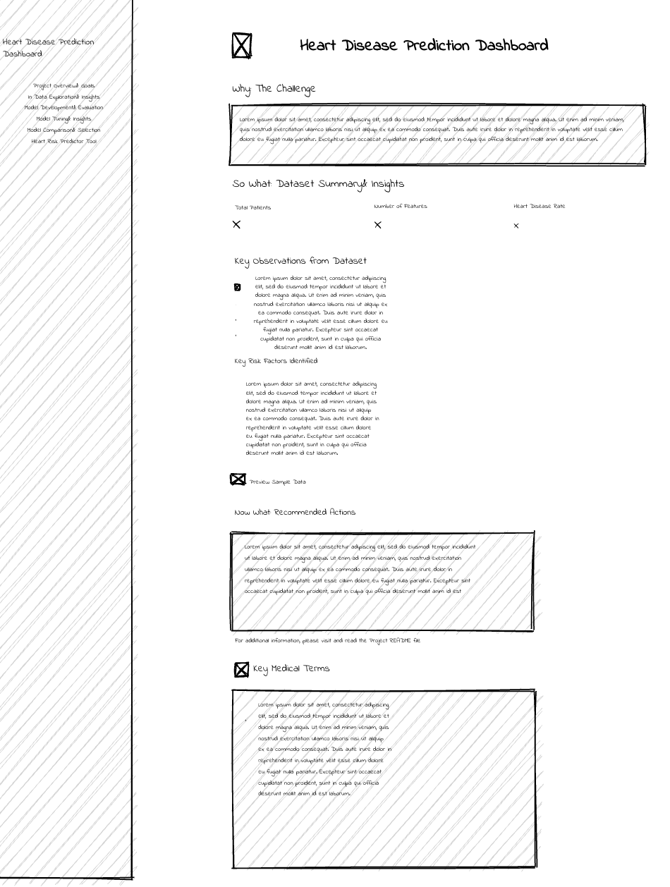

### Predictive tool wireframe

---

## Agile Methodology

GitHub Projects was used in part for the planning of this website to create and track User Stories as they were implemented and fulfilled.

### Github User Story Board

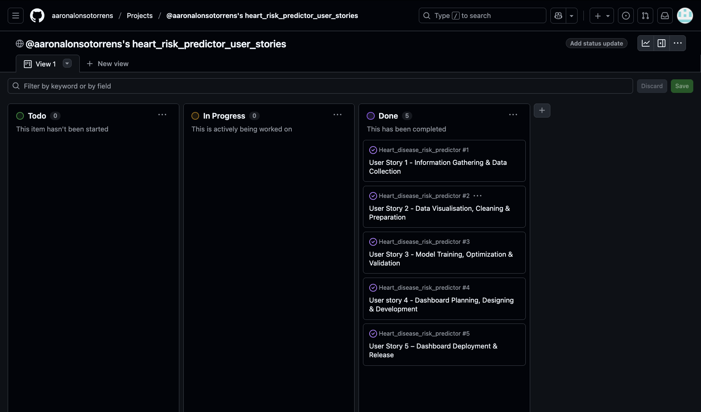

### Github User Story Board Example

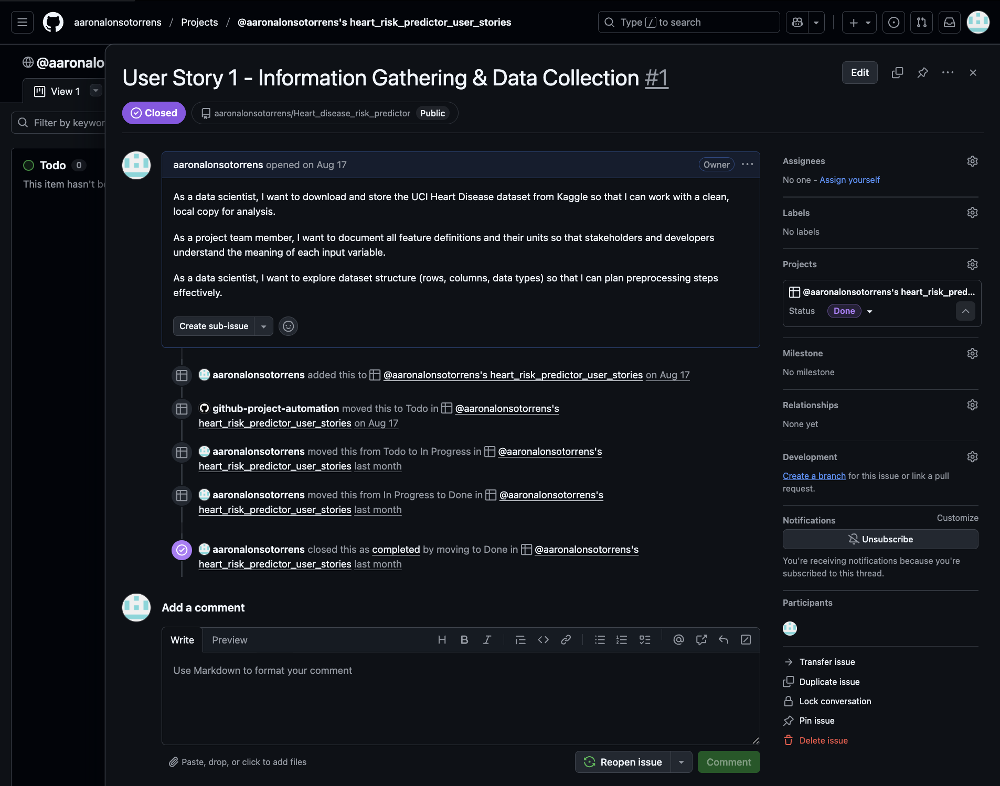

### Kanban board setting to public

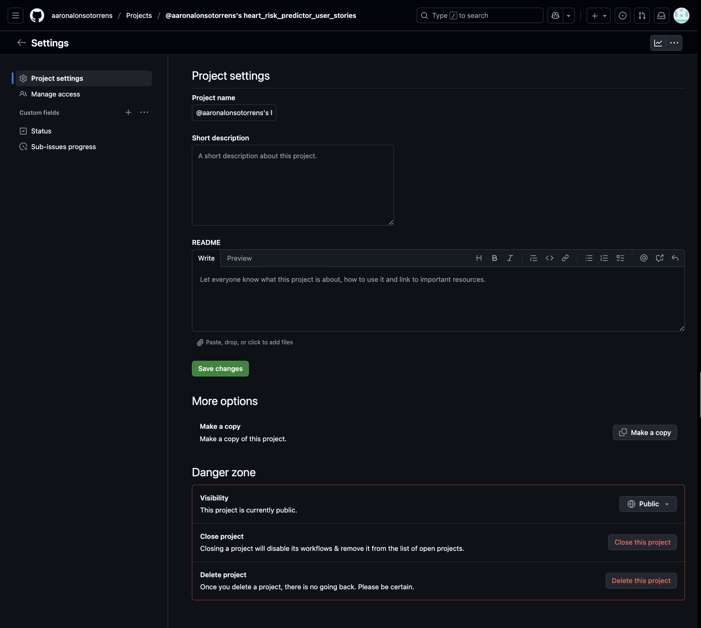

---

## Testing

### Python Testing

The project was tested for pep8 compliance using pycodestyle.

### App_pages python code test

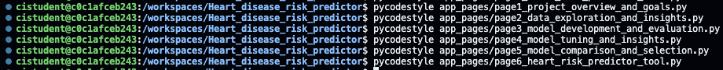

### Python code across files

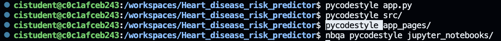

### Automated Testing

Below the steps for manual testing of the site have been arranged into tables.

### Manual testing

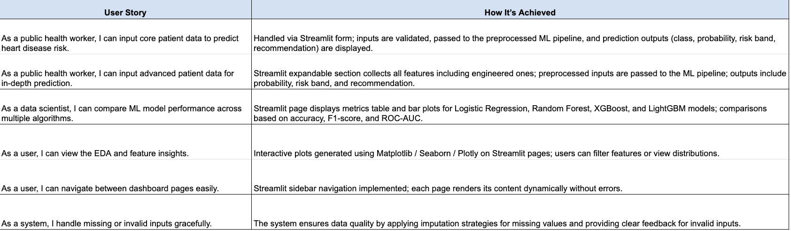

### User story testing

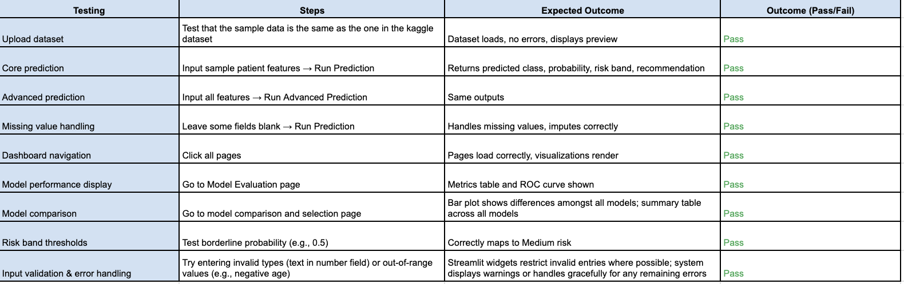

---

## Browser Compatibility

The website was tested on:

- Chrome Version
- Firefox Version
- Safari iOS

---

## Technologies Used

- **[Python 3](https://www.python.org/)** – Core programming language for data preprocessing, modeling, and deployment.  
- **[Pandas](https://pandas.pydata.org/)** – For data manipulation and preparation.  
- **[NumPy](https://numpy.org/)** – For numerical computing and efficient array operations.  
- **[Matplotlib](https://matplotlib.org/)** – For static visualizations.  
- **[Seaborn](https://seaborn.pydata.org/)** – For statistical data visualization and correlation analysis.  
- **[Plotly](https://plotly.com/)** – For interactive charts in the dashboard.  
- **[Scikit-learn](https://scikit-learn.org/stable/)** – For preprocessing, baseline ML models, and evaluation metrics.  
- **[XGBoost](https://xgboost.readthedocs.io/)** – Gradient boosting framework for advanced classification models.  
- **[LightGBM](https://lightgbm.readthedocs.io/)** – Gradient boosting library optimized for speed and efficiency.  
- **[Streamlit](https://streamlit.io/)** – For building the interactive prediction dashboard.  
- **[Heroku](https://www.heroku.com/)** – For deployment of the Streamlit app.  
- **[Git](https://git-scm.com/)** – Version control for project tracking and collaboration.  
- **[GitHub](https://github.com/)** – Hosting the project repository.  
- **[Uiwizard](https://uizard.io/)** – Used for wireframe design and layout planning.  
- **[Pycodestyle](https://pycodestyle.pycqa.org/)** – For PEP8 compliance and code quality checks.  
- **[Jupyter Notebooks](https://jupyter.org/)** – For iterative development, experimentation, and presenting workflows.

---

## Unfixed Bugs

Advanced Input Expander Behavior

- Due to the way Streamlit reruns the script on any widget interaction, the “Full Advanced Input” expander collapses
  after clicking a prediction button by default.

- This is normal behavior and not a bug.

- We handle this in the code using st.session_state so that the expander remains open after running predictions.

---

## Deployment

You can deploy this Streamlit app on Heroku by following these steps:

- Create setup.sh

Create a file named setup.sh in the project root with the following content:

mkdir -p ~/.streamlit/

echo "\
[server]\n\
headless = true\n\
port = \$PORT\n\
enableCORS = false\n\
\n\
" > ~/.streamlit/config.toml

- Create a Procfile

Create a file named Procfile (no extension) in the project root:

web: sh setup.sh && streamlit run app.py

This tells Heroku how to start your app.

- Deploy to Heroku

  - Login to Heroku (or create an account if needed):

  - heroku login

  - Create a new app:

    - Go to your Heroku Dashboard

    - Click Create New App.

    - Enter a unique name for your app and select your preferred region.

    - Click Create App.

  - Go to deploy

- Connect your GitHub repository:

  - In your app’s Heroku dashboard, go to the Deploy tab.

  - Under Deployment method, choose GitHub and connect your repo.

  - Select the branch you want to deploy (usually main).

- Deploy the app:

  - Click Deploy Branch.

  - Once the build finishes, click View or go to the Open App button at the top-right of the dashboard.

Your Streamlit app should now be live!

---

## Acknowledgements

I would like to extend my gratitude to the following for their support and resources, throughout the development of this project:

- **[Kaggle](https://www.kaggle.com/)** – For providing access to the Heart Disease dataset used for model training and evaluation.  
- **[Scikit-learn Documentation](https://scikit-learn.org/stable/)** – For clear guidance on preprocessing, model building, and evaluation metrics.  
- **[XGBoost Documentation](https://xgboost.readthedocs.io/)** and **[LightGBM Documentation](https://lightgbm.readthedocs.io/)** – For detailed references on gradient boosting methods applied in this project.  
- **[Streamlit Documentation](https://docs.streamlit.io/)** – For enabling the development of an accessible, interactive dashboard.  
- **[Matplotlib](https://matplotlib.org/)**, **[Seaborn](https://seaborn.pydata.org/)**, and **[Plotly](https://plotly.com/)** – For providing powerful tools for visualizing data and model insights.  
- **[Stack Overflow](https://stackoverflow.com/)** – For being a go-to resource when troubleshooting technical challenges.  
- **[W3Schools](https://www.w3schools.com/)** and **[MDN Web Docs](https://developer.mozilla.org/)** – For clear explanations of Python, data handling, and general programming concepts.  
- **[ChatGPT](https://chat.openai.com/)** – For guidance with project planning, documentation structuring, and troubleshooting.  
- **[Uiwizard](https://uizard.io/)** – For wireframing and planning dashboard layouts.  

A special thank you goes to my mentor Can Sucullu and CodeInstitute for their constructive feedback and encouragement, which helped refine both the technical and presentation aspects of this project.
